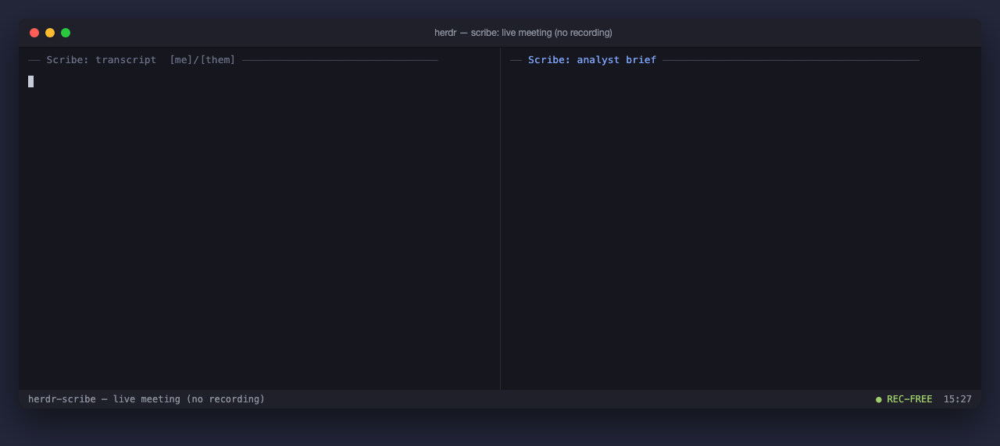

# herdr-scribe

Live, **no-recording** meeting transcription for [herdr](https://herdr.dev) — the terminal multiplexer for coding agents.



*A meeting as it happens: live `[me]`/`[them]` captions stream in on the left, the analyst's rolling brief lands on the right — and no audio file anywhere. ([still version](docs/hero.png))*

Your mic (and, optionally, remote participants on a video call) stream straight through a local speech-to-text model into a live transcript pane and a rolling "what's happening now" analyst pane. **No audio file is ever written** — audio lives only in an in-memory pipe and is destroyed when the meeting ends. On stop, scribe writes the transcript and generates a plain meeting note (attendees, decisions, action items).

## Why

Meeting recorders create a file you then have to store, protect, and delete. scribe never creates one: it transcribes in real time from an in-memory audio pipe and keeps only text. You get a searchable transcript and a live brief without a recording sitting on disk.

## Features

- **No recording** — raw-PCM pipe → speech-to-text → RAM-only transcript (`/dev/shm`); no audio file, ever. Buffers destroyed on stop.
- **Live transcript pane** — streaming text as people talk.
- **Live analyst pane** — a headless model summarizes the transcript-so-far every N seconds into a rolling Now / Commitments / Open-questions brief.
- **Remote-participant capture (optional)** — on Windows/WSL, a userland loopback of the default render device captures the far end of a call; lines tag `[me]` / `[them]`.
- **Screen-OCR context (optional)** — periodically OCR the shared screen to feed the analyst.
- **Glossary hotwords** — bias the recognizer toward expected names/terms.
- **Consent-aware** — records the consent basis you declare (`one-party` / `all-party`) in the output.
- **Pluggable on-stop hook** — `SCRIBE_ON_STOP` runs any command against the finished transcript; the default is a generic meeting-note generator.

## Requirements

- herdr ≥ 0.7.0
- A speech-to-text engine (default: [`faster-whisper`](https://github.com/SYSTRAN/faster-whisper), `base.en`)
- Linux or WSL2 with a working mic capture source (WSLg / PulseAudio), **or
  macOS** (mic capture via `ffmpeg`'s avfoundation backend — auto-selected
  when `parec` is absent; macOS prompts for microphone permission on first
  use). macOS has no tmpfs, so either accept the temp-dir fallback for the
  transcript text or run `scribe-ramdisk-macos.sh` and point
  `SCRIBE_RAMROOT` at the printed RAM disk.
- Optional: Windows host for remote-participant loopback capture (also needs
  `ffmpeg` on the machine running `scribe.sh`, to resample that stream)
- A headless LLM command for the analyst / notes (configurable; default `claude -p`)

## Install

```
herdr plugin install Javamomma/herdr-scribe
```

This drops `start` / `stop` / `status` / `abort` actions and a transcript +
analyst pane pair into herdr. See `docs/DESIGN.md` for the full plugin
surface.

## Usage

### 1. Install

From GitHub:

```
herdr plugin install Javamomma/herdr-scribe
```

or for development, clone and link your working copy:

```
herdr plugin link /path/to/herdr-scribe
```

The manifest is validated against herdr 0.7.3; `herdr plugin list` should
show the `scribe` plugin with five actions and three pane entrypoints.

### 2. Invoke the actions

Run actions from herdr's action menu, the CLI, or a key you bind yourself
(herdr 0.7 does not bind keys from plugin manifests — add bindings to
`~/.config/herdr/config.toml` and `herdr server reload-config`):

```
herdr plugin action invoke start  --plugin scribe
herdr plugin action invoke stop   --plugin scribe
herdr plugin action invoke status --plugin scribe   # output: herdr plugin log list --plugin scribe
herdr plugin action invoke abort  --plugin scribe
herdr plugin action invoke artifacts --plugin scribe
```

`start` opens the transcript pane and (unless `SCRIBE_NO_ANALYST=1`) the
analyst pane; `stop`/`abort` close them, and `stop` opens the artifact
review pane when artifacts are enabled. herdr actions can't prompt for
flags, so `start` reads its parameters from the environment:
`SCRIBE_DEFAULT_CONSENT` (required — start refuses without an explicit
consent regime) plus optional `SCRIBE_DEFAULT_TOPIC` / `_SCOPE` /
`_ATTENDEES`. The full-flag CLI below works in any terminal regardless.

### 3. Configure

Copy the templates and fill in what applies to your machine — everything is
optional and has a neutral default:

```
cp scribe.conf.example scribe.conf
cp glossary.txt.example glossary.txt   # optional: hotword names/terms
```

`scribe.conf` is auto-sourced by `scribe.sh` on every run. Every variable it
sets is documented inline in `scribe.conf.example` — capture source, STT
backend, output directory, the LLM command used by the analyst/notes, the
optional Windows loopback and screen-OCR bridges, and more. Because
`scribe-analyst.sh` and the pane commands in `herdr-plugin.toml` are spawned
directly by herdr (not as children of `scribe.sh`), also `source
scribe.conf` from your shell profile (or wherever herdr launches its own
process from) if you want those to see the same config — see the note at
the top of `scribe.conf.example`.

Both `scribe.conf` and `glossary.txt` are gitignored — never commit your
real copies, only the `.example` templates.

### 4. Run a meeting

```
# Start a meeting. --consent is required: declare the recording-consent
# regime that applies to this call.
bash scribe.sh start --consent one-party --topic "Acme standup" --attendees "Alice, Bob"

# Also capture remote participants (needs the optional Windows loopback
# bridge — see "Optional bridges" below); falls back to mic-only with a
# warning if it isn't built.
bash scribe.sh start --consent one-party --teams

# Skip the live analyst pane for this meeting:
bash scribe.sh start --consent one-party --no-analyst

# The analyst's refresh cadence and the LLM command it (and the on-stop note
# generator) run are set via env, not a `start` flag -- see scribe.conf.example:
#   export SCRIBE_ANALYST_INTERVAL="30"
#   export SCRIBE_LLM_CMD="claude -p --model <id>"

# Check what's running (prints the meeting id, or "none"):
bash scribe.sh status

# End the meeting: writes the transcript to SCRIBE_OUTPUT_DIR, generates the
# meeting note, runs the optional gate, destroys the RAM buffers (or
# quarantines them on a gate hold), then runs the on-stop hook (see below).
# Prints the transcript path.
bash scribe.sh stop

# Discard the meeting instead: destroys everything, writes nothing, no note.
bash scribe.sh abort
```

herdr's single-meeting model means only one meeting runs at a time; `start`
refuses to run again until the current one is `stop`ped or `abort`ed.

### 5. What happens on `stop`

`stop` runs a fixed sequence, each step fail-safe so a downstream failure
can never lose the meeting:

1. **Transcript out.** `transcript.md` is copied to `SCRIBE_OUTPUT_DIR`
   (durable from this point on).
2. **Note.** `scribe-notes` feeds the transcript to `SCRIBE_LLM_CMD` and
   writes a plain meeting note (Attendees / Decisions / an owner-attributed
   Action Items table) alongside it. Replace the generator with
   `SCRIBE_NOTES_CMD`; if you instead point `SCRIBE_ON_STOP` at your own
   pipeline (the classic seam) and set no `SCRIBE_NOTES_CMD`, core writes
   no note of its own — exactly the pre-gate behavior.
3. **Gate (optional).** If `SCRIBE_GATE_CMD` is set it runs with the note
   path and the still-live meeting dir, hard-timeboxed. Exit 0 → proceed;
   exit 75 → **hold**; anything else (including a timeout) → hold — fail
   closed in both directions. A hold moves the meeting dir to
   `SCRIBE_QUARANTINE_DIR` (never inside the RAM root) instead of
   destroying it, and skips the downstream steps. Every outcome appends one
   line to the audit log (`SCRIBE_AUDIT_LOG`). Core ships the seam and no
   policy: it records the gate's own message and takes no view on it.
4. **Destroy.** On a clear verdict the RAM dir and all buffers are removed.
5. **Artifacts (optional, `SCRIBE_ARTIFACTS=1`).** See §8.
6. **Hook.** If `SCRIBE_ON_STOP` is set, it runs against the written
   transcript. If it fails, the transcript stays where `stop` wrote it.

### 6. Scopes and the per-meeting glossary

`start --scope <name>` tags the meeting with a neutral work-item key. When a
scope is supplied, scribe derives per-meeting recognizer hotwords from the
scope's own context — `"$SCRIBE_SCOPE_ROOT/<scope>/glossary.txt"` plus the
`--attendees`/`--topic` you passed — deduplicates them, and feeds them to
the STT worker *additively* for this meeting only. The reviewed global
`SCRIBE_GLOSSARY` file is never modified. Disable with
`SCRIBE_MEETING_GLOSSARY=0`.

### 7. The deep analyst (document retrieval)

Off by default; enable by pointing `SCRIBE_DEEP_CORPUS_ROOT` at a document
corpus. The live analyst may then flag one retrieval per cycle when the
conversation references a document, and a detached worker searches the
corpus (read-only, fixed-string), extracts text via `scribe-doc2text`, and
appends the **verbatim** passage with its source path to the analyst pane —
"not found" is an acceptable answer; a paraphrase is not. One retrieval in
flight at a time (later triggers coalesce), hard-timeboxed
(`SCRIBE_DEEP_TIMEOUT`), separate model command via `SCRIBE_LLM_CMD_DEEP`.
`scribe-doc2text` handles plaintext natively, `pdftotext`/`pandoc` formats
when installed, and anything else via `SCRIBE_EXTRACT_CMD_<EXT>`.

### 8. Auto-artifacts (draft, review, approve)

With `SCRIBE_ARTIFACTS=1`, `stop` classifies the meeting **note** for
follow-up documents the meeting implied (a summary for an absent audience, a
status update, a memo…), auto-drafts up to `SCRIBE_ARTIFACT_CAP` (default 6)
of the strong candidates, and queues the rest — every candidate, built and
skipped alike, is recorded so a skipped one can be approved later:

```
bash scribe.sh artifacts                 # review view for the last meeting
bash scribe.sh artifacts <meeting>       # ... for a specific meeting
bash scribe.sh artifacts <meeting> --approve 4 5
bash scribe.sh artifacts <meeting> --approve-all
bash scribe.sh artifacts --all           # bounded cross-meeting summary
```

Drafts are local files under `SCRIBE_ARTIFACT_OUT_DIR`, back-linked into the
note, each with an open review task — nothing is ever sent anywhere. The
review surface makes zero model calls. Inside tmux, `stop` also opens an
interactive review pane (`SCRIBE_REVIEW_PANE=0` to disable).

### 9. Optional bridges

Both are fully optional and degrade gracefully (mic-only / no screen
context) when unavailable — run `bash scribe.sh --doctor` any time to see
what's currently available on your machine:

```
bash scribe.sh --doctor
```

- `scribe-loopback-setup.sh` builds the Windows remote-participant loopback
  bridge (userland WASAPI via NAudio, compiled with the in-box `csc.exe`).
  Wire the result in via `SCRIBE_LOOPBACK_EXE`. The loopback exe emits the
  render device's raw mix format, not the s16le/16k/mono the transcriber
  needs, so `--teams` also requires `ffmpeg` on the machine running
  `scribe.sh` to resample the `[them]` stream in flight (see
  `SCRIBE_LOOPBACK_FORMAT`/`_RATE`/`_CHANNELS` in `scribe.conf.example` if a
  device's mix format isn't the common 32-bit-float/48kHz/stereo default).
  Missing `ffmpeg` degrades the same way as a missing exe: a warning and
  mic-only.
- `scribe-screen-setup.sh` wires up optional screen-OCR context for the
  analyst (needs a screenshot tool + `tesseract`). Wire the result in via
  `SCRIBE_SCREEN_OCR_CMD`.

## License

MIT — see `LICENSE`.
